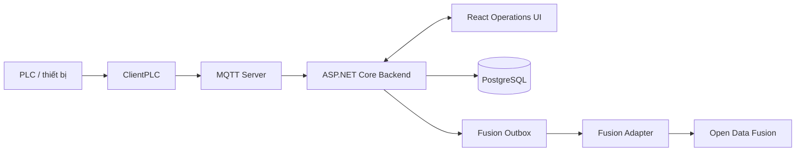

# Foxconn AI Solution
> [Tiếng Việt](README.md) · [English](README.en.md) · [简体中文](README.zh-CN.md)

## Overview

Foxconn AI Solution is an on-premises industrial monitoring platform for machinery, production lines, telemetry, and alarms. The system ingests telemetry through PLC/MQTT, stores operational data in PostgreSQL, and provides a real-time Operations UI.

## Core capabilities

- Collect data from PLCs through the ClientPLC application and MQTT.
- Monitor machine status, production output, telemetry, and alarms in a single Operations UI.
- Store and serve operational data with ASP.NET Core and PostgreSQL.
- Synchronize a reliable telemetry replica to Open Data Fusion through a transactional outbox, isolated from the MQTT hot path.
- Deploy and operate the Operations, Fusion Adapter, and Open Data Fusion components independently.

## Architecture

The PLC and Operations flows form a local operational boundary; Open Data Fusion receives data only through the outbox and adapter, so ODF failures must not block telemetry ingestion.



## Components

| Path | Role |
| --- | --- |
| `frontend/` | Operations UI built with React + Vite. |
| `backend/` | ASP.NET Core backend, MQTT, and PostgreSQL. |
| `ClientPLC/` | WPF client that connects to and monitors PLC devices. |
| `fusion-contracts/` | Versioned shared contracts for Fusion events. |
| `fusion-adapter/` | Outbox dispatcher that delivers events to ODF. |
| `third_party/open-data-fusion/` | Pinned upstream Git submodule for Open Data Fusion. |

## Quick start

Prerequisites: .NET 9 SDK, Node.js, a reachable PostgreSQL instance configured through the backend connection string, and Docker Desktop when using the ODF preview. ClientPLC runs on Windows and requires the .NET 9 Windows Desktop SDK.

Start end-to-end in the safe sequence:

1. Clone the source and initialize the submodule:

```powershell
git clone https://github.com/HaydernCenterpoint/Foxconn-AI-Solution.git
cd Foxconn-AI-Solution
git submodule update --init --recursive
```

2. The backend also hosts the MQTT server. Enable local outbox capture before starting the backend:

```powershell
$env:OpenDataFusion__CaptureEnabled = 'true'
dotnet run --project backend/backend.csproj
```

3. If you use the ODF preview, start `application-preview` and wait for `http://127.0.0.1:54310/ready` to return successfully before continuing:

> [!WARNING]
> `application-preview` uses SQLite only for local/dev mapping preview; do not use this profile or its `.env` file in production.

```powershell
Copy-Item infrastructure/open-data-fusion/.env.example third_party/open-data-fusion/.env
Push-Location third_party/open-data-fusion
docker compose --env-file .env --profile application-preview up -d
Pop-Location
```

4. Keep `OpenDataFusion__DispatchEnabled` disabled until ODF has a tenant, project, and identity. Then configure it according to the [Open Data Fusion guide](infrastructure/open-data-fusion/README.md), enable dispatch, and run Fusion Adapter in a separate terminal; never put secrets in documentation or source code:

```powershell
$env:OpenDataFusion__DispatchEnabled = 'true'
dotnet run --project fusion-adapter/Fusion.Adapter.csproj
```

5. Once the components above are ready, start ClientPLC with the environment's PLC configuration and run the Operations UI in a separate terminal:

**Start ClientPLC:**

```powershell
dotnet run --project ClientPLC/ClientPLC.App/ClientPLC.App.csproj
```

**Start the Operations UI:**

```powershell
npm --prefix frontend install
npm --prefix frontend run dev
```

## Open Data Fusion integration

Two switches are managed independently to control the synchronization flow:

- `OpenDataFusion__CaptureEnabled`: controls local transactional outbox capture in the backend. When enabled, valid telemetry is recorded with an outbox intent; the backend does not call ODF directly from the MQTT hot path.
- `OpenDataFusion__DispatchEnabled`: controls delivery through Fusion Adapter. It enables Fusion Adapter to deliver pending outbox events to ODF. Enable it only after ODF is ready for the relevant environment.

See the [Open Data Fusion guide](infrastructure/open-data-fusion/README.md) for activation, production topology selection, and safe rollback.

## Project structure

The main directories directly related to the platform are:

```text
.
├── backend/                         # ASP.NET Core Operations API
├── backend.Tests/                   # Kiểm thử backend
├── ClientPLC/                       # Ứng dụng WPF cho PLC
├── frontend/                        # React + Vite Operations UI
├── fusion-contracts/                # Contract dùng chung
├── fusion-adapter/                  # Worker dispatch outbox sang ODF
├── fusion-adapter.Tests/            # Kiểm thử Fusion Adapter
├── infrastructure/open-data-fusion/ # Cấu hình và hướng dẫn ODF
├── docs/superpowers/specs/          # Thiết kế tích hợp
└── third_party/open-data-fusion/    # Upstream Git submodule được ghim
```

## Test and build

Run from the repository root:

```powershell
dotnet test backend.Tests/backend.Tests.csproj
dotnet test fusion-adapter.Tests/Fusion.Adapter.Tests.csproj
npm --prefix frontend run test:run
npm --prefix frontend run type-check
npm --prefix frontend run build
```

## Related documentation

- [Open Data Fusion operations](infrastructure/open-data-fusion/README.md)
- [Open Data Fusion integration design](docs/superpowers/specs/2026-07-13-open-data-fusion-integration-design.md)

## Security and operations notes

Do not commit secrets or production credentials to the repository. For production ODF, manage credentials and configuration through the deployment environment's secret manager, and keep sensitive configuration outside tracked source code.
