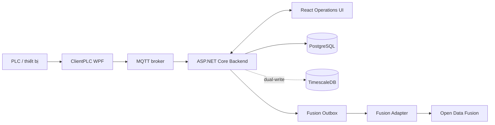

# Foxconn AI Solution (FII AI / MKZ Factory Monitor)

> [Tiếng Việt](README.md) · [English](README.en.md) · [简体中文](README.zh-CN.md)

> **Trạng thái phát hành:** **NO-GO cho production — chỉ là staging candidate.**  
> Quyết định phát hành lấy từ [Go/No-Go hiện hành](docs/release-evidence/2026-07-31-go-nogo-status.md) và [PROJECT_PLAN.md](PROJECT_PLAN.md).  
> Build/test local **không** thay thế managed staging gate.

**Tài liệu đầy đủ**

| Bản | Mô tả |
| --- | --- |
| [docs/PROJECT-GUIDE.vi.md](docs/PROJECT-GUIDE.vi.md) | Hướng dẫn dự án chi tiết (Markdown, tiếng Việt) |
| [docs/FII-AI-Huong-Dan-Du-An.docx](docs/FII-AI-Huong-Dan-Du-An.docx) | Bản trình bày Word đẹp, đủ chương |
| [docs/PROJECT-REPORT.en.docx](docs/PROJECT-REPORT.en.docx) | Báo cáo tiếng Anh (stakeholder) |

---

## 1. Giới thiệu dự án

**FII AI** (Foxconn AI Solution / MKZ Factory Monitor) là nền tảng **Industrial IoT on-prem** giám sát nhà máy:

- Đọc dữ liệu từ **PLC** qua ClientPLC (WPF)
- Truyền **telemetry** qua **MQTT**
- Lưu vận hành trong **PostgreSQL** (authoritative), mirror tùy chọn sang **TimescaleDB**
- Đánh giá **sự kiện / CEP / cảnh báo**, tính **health score** và **rủi ro hỏng**
- Hiển thị realtime trên **Operations UI** (React)
- Đồng bộ phụ sang **Open Data Fusion** qua transactional outbox (không chặn hot path MQTT)

### Giá trị mang lại

| Đối tượng | Lợi ích |
| --- | --- |
| Vận hành | Một màn hình theo dõi máy, line, sản lượng, alarm |
| Kỹ sư | Drill-down telemetry, health, anomaly, RCA context |
| Quản trị | User/role, audit log, simulation, báo cáo |
| IT / Data | Outbox → ODF, dual-write Timescale, connector ERP/MES (staging) |

### Phạm vi repository

| Thư mục | Vai trò |
| --- | --- |
| `backend/` | ASP.NET Core API, MQTT broker, CEP, alerts, health, prediction |
| `frontend/` | React Operations UI |
| `ClientPLC/` | WPF edge client đọc PLC, offline queue, MQTT |
| `fusion-contracts/`, `contracts/v1/` | Contract versioned (asset/telemetry/event/API) |
| `fusion-adapter/` | Dispatch outbox → Open Data Fusion |
| `infrastructure/` | Timescale, demo, staging gate, ODF preview scripts |
| `factory-ai-platform/` | Gateway, CEP/ML, RAG, report, asset, data-platform |
| `Open-Data-Fusion/`, `third_party/open-data-fusion/` | Data fusion product + submodule pin |
| `Odysseus/` | AI assistant tùy chọn — **không thuộc scope lõi FII** |

---

## 2. Kiến trúc



**Ranh giới quan trọng**

1. **Operations path** (PLC → MQTT → Backend → DB → UI) phải chạy độc lập khi ODF/AI lỗi.
2. **PostgreSQL Operations** là nguồn sự thật vận hành; Timescale là mirror/query tối ưu.
3. **ODF** chỉ nhận dữ liệu qua outbox + adapter — không gọi ODF từ hot path MQTT.
4. **Factory AI / Odysseus** là plane bổ sung, không chặn ingest.

### Luồng end-to-end

1. ClientPLC poll PLC (HslCommunication), chuẩn hóa trạng thái máy, lưu SQLite.
2. MQTT gửi payload (có thể TLS + device token + mã hóa payload).
3. Backend ingest → PostgreSQL; optional Timescale dual-write.
4. EventRuleEngine / CEP tạo event & alert (ack/resolve lifecycle).
5. HealthScoringJob / PredictiveService tính health, anomaly, failure risk.
6. UI đọc REST (+ SignalR/polling) cho dashboard, machines, alarms.
7. Capture outbox → Fusion Adapter → ODF (khi bật).

---

## 3. Công nghệ sử dụng

| Lớp | Stack |
| --- | --- |
| **Backend** | .NET 9, ASP.NET Core, MQTTnet, Npgsql, JWT Bearer, SignalR, Swagger, BCrypt |
| **ClientPLC** | .NET 9 WPF, HslCommunication (27+ brand), MQTTnet, SQLite, Serilog |
| **Frontend** | React 19, TypeScript, Vite 8, React Router 7, Axios, Zustand, TanStack Query, Recharts, GSAP, i18next, Zod, Tailwind 4 |
| **Data** | PostgreSQL, TimescaleDB (hypertable, rollup, retention) |
| **AI plane** | Python, FastAPI, scikit-learn, pgvector, MinIO |
| **ODF** | Node.js, Express, React/Vite, PostgreSQL, Redis Streams, OIDC/Keycloak |
| **QA / delivery** | xUnit, Vitest, Playwright, pytest, Docker Compose, PowerShell, GitHub Actions CI |

### Contract dùng chung (không đổi tự ý)

| Contract | Hình dạng cốt lõi |
| --- | --- |
| Asset | `id`, `type`, `name`, `code`, `parentId`, metadata |
| Telemetry | `(time, assetId, metric, value)` |
| Event | `eventId, timestamp, assetId, type, severity, payload` |
| API | REST `/api/v1/...`, JSON camelCase, JWT Bearer, lỗi **RFC 7807** `problem+json` |

---

## 4. Chức năng chi tiết

### 4.1 ClientPLC (edge)

- Kết nối nhiều loại PLC qua HslCommunication / profile động  
- Polling tag, heartbeat, production, CPU/RAM  
- Trạng thái: `RUNNING` / `IDLE` / `STOPPED` / `ERROR` / `OFFLINE`  
- Alarm edge detection + lịch sử local  
- Offline queue SQLite khi mất mạng  
- MQTT reconnect, device token (`FII_MQTT_DEVICE_TOKEN`), optional AES payload  
- Import cấu hình Excel/JSON  

### 4.2 Operations backend

| Nhóm | Khả năng |
| --- | --- |
| Asset / Line / Machine | CRUD, tree, search, catalog |
| Telemetry | Live, log, query, Timescale rollup |
| Alerts / Alarms | Lifecycle open → acknowledge → resolve, dedup, suppression |
| Intelligence | Health score (multi-factor), anomaly (z-score), failure risk, RCA context |
| CEP | Event rules (`event-rules.json`), staging publisher |
| Auth | Login/session cookie, JWT, service-account API key (hash storage) |
| Sync | `/api/sync` cho ClientPLC |
| Admin | Users, audit log, simulation, reports, connector proxy |

### 4.3 Operations UI

| Luồng | Route tiêu biểu | Mô tả |
| --- | --- | --- |
| Dashboard | `/`, `/admin` | KPI, line/machine, health, alarms |
| Lines | `/lines` | Production line & sơ đồ máy |
| Machines | `/machines`, `/machines/:id` | Danh sách + drill-down telemetry |
| Alarms | `/alarms` | Lọc, chi tiết, ack/resolve |
| Reports / Analysis | `/admin/reports`, `/production-analysis` | Báo cáo & phân tích sản lượng |
| Simulation | `/admin/simulation` | Dữ liệu demo |
| Admin | `/admin/users`, `/admin/audit-logs`, `/admin/settings` | User, audit, settings |
| Slideshow | `/slideshow` | Presentation vận hành |

**Vai trò:** `ADMIN` (đầy đủ) · `ENGINEER` (vận hành/cấu hình) · `GUEST` (chỉ đọc).  
Route guard frontend chỉ hỗ trợ UX — **backend policy** là biên bảo mật thật.

### 4.4 Open Data Fusion & Factory AI

- **Capture / Dispatch** độc lập: `OpenDataFusion__CaptureEnabled`, `OpenDataFusion__DispatchEnabled`  
- Adapter: lease, retry, dead-letter, external ID `mkz:*`  
- Factory AI: gateway chat/tools, CEP/ML, document RAG, report export, asset service, data-platform connectors  

---

## 5. Bảo mật

| Lớp | Cơ chế |
| --- | --- |
| Web session | HttpOnly cookie; **không** lưu bearer trong `localStorage` |
| API | JWT Bearer / service API key; raw key chỉ trả **một lần**, lưu hash |
| RBAC | `ADMIN` / `ENGINEER` / `GUEST` enforce ở backend |
| MQTT | Device token gắn client ID, topic ownership; production bật **TLS**, tắt plaintext |
| Payload | Mã hóa MQTT (AES) khi cấu hình key |
| Abuse | Rate limit toàn cục + login + health; forwarded headers chỉ trust proxy allow-list |
| Secrets | Secret manager / env inject; **không** commit credential; **không** đưa secret qua `VITE_*` |
| Delivery | Transactional outbox, lease, retry, dead state |
| ODF write-back | Policy + approval + external executor (không tự ghi mù) |
| Supply chain | CI, dependency review, CodeQL, SBOM (theo pipeline) |

Chi tiết env: [docs/security-secrets.md](docs/security-secrets.md).

---

## 6. Hướng dẫn sử dụng

### Yêu cầu

- Windows khuyến nghị (ClientPLC bắt buộc Windows + .NET 9 Desktop SDK)  
- .NET 9 SDK, Node.js 20+, Docker Desktop (demo/Timescale/ODF)  
- PostgreSQL (hoặc container demo)  

### 6.1 Demo UI không backend (nhanh nhất)

```powershell
npm --prefix frontend ci
npm --prefix frontend run demo
```

Mở `http://127.0.0.1:3000`. Chỉ mock **GET**; thao tác ghi không giả lập thành công.  
Luồng demo: Dashboard → Lines → Machines → Alarms → Slideshow.

### 6.2 Full stack demo (khuyến nghị rehearsal)

```powershell
git clone https://github.com/HaydernCenterpoint/Foxconn-AI-Solution.git
cd Foxconn-AI-Solution
git submodule update --init --recursive

.\infrastructure\demo\Start-FullDemo.ps1
.\infrastructure\demo\Test-FullDemo.ps1
```

Mặc định (localhost): UI `3001`, backend `5166`, Odysseus `7000`, ODF web `58088`, ODF API `54310`.  
Thêm `-WithClientPlc` khi cần WPF. Log: `.runtime-logs/`.  
Dùng tài khoản seed/demo của môi trường — **không** ghi mật khẩu demo vào repo/docs.

### 6.3 Chạy từng thành phần

**Backend**

```powershell
$env:ConnectionStrings__DefaultConnection = '<postgres-url>'
$env:Jwt__Key = '<secret->=32-bytes>'
$env:Mqtt__EncryptionKey = '<mqtt-key>'
dotnet run --project backend/backend.csproj
```

Hữu ích: `--database-preflight`, `--database-migrate`, `--timescale-backfill`.

**Frontend**

```powershell
$env:VITE_API_URL = 'http://localhost:5166/api'
npm --prefix frontend install
npm --prefix frontend run dev
```

**ClientPLC**

```powershell
dotnet run --project ClientPLC/ClientPLC.App/ClientPLC.App.csproj
```

**ODF preview (loopback only)**

```powershell
.\infrastructure\open-data-fusion\Start-OpenDataFusionPreview.ps1
.\infrastructure\open-data-fusion\Test-OpenDataFusionPreview.ps1
```

> `application-preview` dùng SQLite local — **không** dùng cho production.

**Fusion Adapter** (sau khi ODF có tenant/project/identity)

```powershell
$env:OpenDataFusion__DispatchEnabled = 'true'
dotnet run --project fusion-adapter/Fusion.Adapter.csproj
```

### 6.4 Kiểm thử

```powershell
dotnet test backend.Tests/backend.Tests.csproj
dotnet test fusion-adapter.Tests/Fusion.Adapter.Tests.csproj
dotnet test ClientPLC/ClientPLC.Tests/ClientPLC.Tests.csproj
npm --prefix frontend run test:run
npm --prefix frontend run type-check
npm --prefix frontend run build
npm --prefix frontend run e2e
```

### 6.5 API nhanh

```text
GET  /api/health
POST /api/auth/login
GET  /api/dashboard/summary
GET  /api/machines/{id}
GET  /api/alarms  ·  POST .../acknowledge  ·  POST .../resolve
GET  /api/telemetry/live  ·  /api/telemetry/query
GET  /api/v1/assets/{id}/health
POST /api/v1/predictions/anomaly
GET  /api/v1/predictions/risk/{assetId}
POST /api/v1/rca
POST /api/sync/upload
```

Swagger bật ở Development. Shape chính thức nằm ở controller + `contracts/v1/`.

---

## 7. Trạng thái & kế hoạch tương lai

### Hiện tại (~84% local Phase 2)

| Hạng mục | Trạng thái |
| --- | --- |
| Phase 1 MVP | ✅ Hoàn thành |
| Phase 2 local (alert, health, prediction, RBAC) | ✅ Local complete |
| Integration W8 local (MQTT → DB → UI) | ✅ Có evidence |
| Managed staging (HTTPS, secrets, 16 checks) | ⬜ Pending |
| Production / canary | ⬜ **NO-GO** |

### Trước go-live (W10)

1. Managed HTTPS ingress + cookie Secure/SameSite  
2. Secret manager (JWT, MQTT PFX, DB TLS, device tokens)  
3. Backup / restore / retention drill  
4. Dual-write: `migration → full → rollback → migration`  
5. Một ERP/MES thật + `asset_mapping_rules`  
6. 16 managed checks + independent reviewer  
7. `Test-ManagedStagingGate.ps1` (URL non-loopback HTTPS)  
8. Canary decision  

### Phase 3 (sau staging)

- LLM RCA / causal graph  
- EDA dài hạn + ML model (precision/recall mục tiêu)  
- Mở rộng connector  
- SignalR realtime rộng hơn  
- Storybook / component contracts  
- OWASP ZAP + manual pentest  
- ClientPLC: DI, structured logging, circuit breaker, integration tests  

Roadmap **không** đổi claim: vẫn **staging candidate / NO-GO** cho đến khi managed gate pass.

---

## 8. Cấu trúc thư mục (rút gọn)

```text
.
├── backend/                 # Operations API + MQTT
├── backend.Tests/
├── frontend/                # React SPA
├── ClientPLC/               # WPF PLC client
├── fusion-contracts/        # Shared contracts
├── fusion-adapter/          # Outbox → ODF
├── contracts/v1/            # JSON Schema
├── infrastructure/          # Demo, Timescale, staging, ODF
├── factory-ai-platform/     # AI microservices
├── Open-Data-Fusion/        # ODF product workspace
├── third_party/open-data-fusion/
├── docs/                    # Guide, evidence, security
├── PROJECT_PLAN.md          # Source of truth plan/progress
└── README.md                # File này
```

---

## 9. Tài liệu liên quan

| Tài liệu | Nội dung |
| --- | --- |
| [PROJECT_PLAN.md](PROJECT_PLAN.md) | Plan, progress, remaining work (SoT) |
| [docs/PROJECT-GUIDE.vi.md](docs/PROJECT-GUIDE.vi.md) | Hướng dẫn đầy đủ tiếng Việt |
| [docs/FII-AI-Huong-Dan-Du-An.docx](docs/FII-AI-Huong-Dan-Du-An.docx) | Word guide (tiếng Việt) |
| [docs/security-secrets.md](docs/security-secrets.md) | Secrets & MQTT TLS |
| [infrastructure/staging/](infrastructure/staging/) | Managed gate scripts |
| [docs/release-evidence/](docs/release-evidence/) | Go/No-Go & integration evidence |
| [infrastructure/open-data-fusion/README.md](infrastructure/open-data-fusion/README.md) | ODF preview & topology |

---

## 10. Lưu ý vận hành

- Không commit secret, PFX, connection string, customer data.  
- Không claim production-ready từ CI/local demo.  
- Không xóa `fusion_outbox` khi rollback adapter.  
- Rule `DEFERRED` trong `event-rules.json` **chưa** có evaluator runtime.  
- Prediction hiện là heuristic (z-score) — chưa ML production.  

---

**Liên hệ vận hành nội bộ:** dùng vault `obsidian-fii-ai/` và operator package trong `docs/release-evidence/`.
