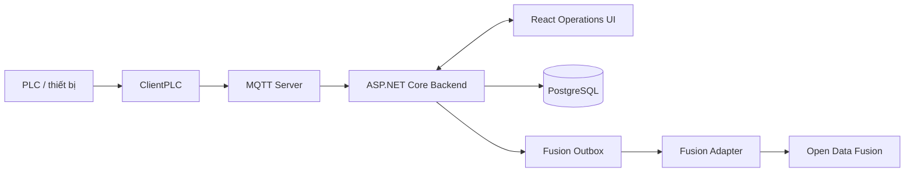

# Foxconn AI Solution
> [Tiếng Việt](README.md) · [English](README.en.md) · [简体中文](README.zh-CN.md)

## Tổng quan

Foxconn AI Solution là nền tảng giám sát công nghiệp triển khai tại chỗ cho máy móc, dây chuyền sản xuất, telemetry và cảnh báo. Hệ thống tiếp nhận telemetry qua PLC/MQTT, lưu dữ liệu vận hành trong PostgreSQL và cung cấp giao diện Operations theo thời gian thực.

## Khả năng chính

- Thu nhận dữ liệu từ PLC qua ứng dụng ClientPLC và MQTT.
- Theo dõi trạng thái máy, sản lượng, telemetry và cảnh báo trong một Operations UI.
- Lưu trữ và phục vụ dữ liệu vận hành bằng ASP.NET Core và PostgreSQL.
- Đồng bộ bản sao telemetry đáng tin cậy sang Open Data Fusion bằng transactional outbox, tách khỏi hot path MQTT.
- Triển khai và vận hành độc lập các thành phần Operations, Fusion Adapter và Open Data Fusion.

## Kiến trúc

Luồng PLC và Operations là ranh giới vận hành cục bộ; Open Data Fusion chỉ nhận dữ liệu qua outbox và adapter, nên sự cố ODF không được phép chặn việc tiếp nhận telemetry.



## Thành phần

| Đường dẫn | Vai trò |
| --- | --- |
| `frontend/` | Operations UI xây bằng React + Vite. |
| `backend/` | Backend ASP.NET Core, MQTT và PostgreSQL. |
| `ClientPLC/` | WPF client kết nối và giám sát thiết bị PLC. |
| `Odysseus/` | Trợ lý AI và cầu nối đọc dữ liệu nhà máy qua REST/RAG. |
| `fusion-contracts/` | Shared contracts có version cho sự kiện Fusion. |
| `fusion-adapter/` | Outbox dispatcher chuyển sự kiện sang ODF. |
| `third_party/open-data-fusion/` | Git submodule upstream được ghim (pinned) cho Open Data Fusion. |

## Khởi chạy nhanh

### Demo UI không cần backend

```powershell
npm --prefix frontend ci
npm --prefix frontend run demo
```

Mở `http://127.0.0.1:3000`. Demo mode chỉ phục vụ dữ liệu synthetic cho các request `GET`; thao tác ghi không được giả lập thành công. Luồng trình bày ngắn: Dashboard → Machines → Machine detail → Alarms → Slideshow.

### Chạy full stack

Điều kiện trước khi chạy: .NET 9 SDK, Node.js, PostgreSQL có thể truy cập được đã cấu hình qua connection string của backend và Docker Desktop nếu dùng ODF preview. ClientPLC chạy trên Windows và yêu cầu .NET 9 Windows Desktop SDK.

Trên Windows, sau khi đã chạy `Odysseus/launch-windows.ps1` ít nhất một lần để tạo virtual environment, có thể khởi động và kiểm tra toàn bộ stack demo bằng hai lệnh:

```powershell
.\infrastructure\demo\Start-FullDemo.ps1
.\infrastructure\demo\Test-FullDemo.ps1
```

Launcher mặc định dùng cùng hostname `localhost`: Operations UI `3001`, backend `5166`, Odysseus `7000`, ODF web `58088` và ODF API `54310`. Đăng nhập Operations UI một lần (`admin` / `admin123` ở dữ liệu demo) sẽ mở Odysseus và Data Fusion bằng cùng phiên; `Test-FullDemo.ps1` kiểm tra cả đăng nhập lẫn đăng xuất dùng chung. Truyền tham số port tương ứng nếu môi trường dùng cổng khác; thêm `-WithClientPlc` khi cần mở cả ứng dụng WPF. Log dịch vụ được ghi vào `.runtime-logs/`.

Khởi động end-to-end theo thứ tự an toàn:

1. Tải mã nguồn và khởi tạo submodule:

```powershell
git clone https://github.com/HaydernCenterpoint/Foxconn-AI-Solution.git
cd Foxconn-AI-Solution
git submodule update --init --recursive
```

2. Backend đồng thời cung cấp MQTT server. Bật ghi nhận outbox local trước khi khởi động backend:

```powershell
$env:OpenDataFusion__CaptureEnabled = 'true'
dotnet run --project backend/backend.csproj
```

Giữ Backend chạy ở terminal A; thực hiện các lệnh preview ODF ở terminal B.

3. Nếu dùng ODF preview, khởi động và kiểm chứng `application-preview` bằng các script an toàn sau:

> [!WARNING]
> `application-preview` dùng SQLite chỉ cho local/dev để xem trước mapping; không dùng profile này cho production. Các script không tạo `third_party/open-data-fusion/.env` và smoke test chỉ chấp nhận URL loopback.

~~~powershell
.\infrastructure\open-data-fusion\Start-OpenDataFusionPreview.ps1
.\infrastructure\open-data-fusion\Test-OpenDataFusionPreview.ps1
~~~

Nếu script khởi động báo cổng PostgreSQL preview mặc định `55432` đang bị chiếm, chọn một cổng trống và chạy lại cả hai lệnh:

~~~powershell
.\infrastructure\open-data-fusion\Start-OpenDataFusionPreview.ps1 -PostgresPort 55433
.\infrastructure\open-data-fusion\Test-OpenDataFusionPreview.ps1
~~~

4. Giữ `OpenDataFusion__DispatchEnabled` tắt cho đến khi ODF đã có tenant, project và identity. Sau đó, cấu hình theo [hướng dẫn Open Data Fusion](infrastructure/open-data-fusion/README.md), bật dispatch và chạy Fusion Adapter trong terminal riêng; không đặt bí mật trong tài liệu hoặc mã nguồn:

```powershell
$env:OpenDataFusion__DispatchEnabled = 'true'
dotnet run --project fusion-adapter/Fusion.Adapter.csproj
```

5. Khi các thành phần trên sẵn sàng, khởi động ClientPLC theo cấu hình PLC của môi trường và chạy Operations UI trong terminal riêng:

**Khởi động ClientPLC:**

```powershell
dotnet run --project ClientPLC/ClientPLC.App/ClientPLC.App.csproj
```

**Khởi động Operations UI:**

```powershell
npm --prefix frontend install
npm --prefix frontend run dev
```

## Tích hợp Open Data Fusion

Hai công tắc được quản lý độc lập để kiểm soát luồng đồng bộ:

- `OpenDataFusion__CaptureEnabled`: bật ghi nhận local transactional outbox trong backend. Khi bật, telemetry hợp lệ được ghi cùng intent outbox; backend không gọi ODF trực tiếp từ hot path MQTT.
- `OpenDataFusion__DispatchEnabled`: bật Fusion Adapter chuyển các sự kiện outbox đang chờ sang ODF. Chỉ bật sau khi ODF đã sẵn sàng cho môi trường tương ứng.

Xem [hướng dẫn Open Data Fusion](infrastructure/open-data-fusion/README.md) để kích hoạt, chọn topology production và rollback an toàn.

## Cấu trúc dự án

Các thư mục chính liên quan trực tiếp đến nền tảng:

```text
.
├── backend/                         # ASP.NET Core Operations API
├── backend.Tests/                   # Kiểm thử backend
├── ClientPLC/                       # Ứng dụng WPF cho PLC
├── frontend/                        # React + Vite Operations UI
├── fusion-contracts/                # Contract dùng chung
├── fusion-adapter/                  # Worker dispatch outbox sang ODF
├── fusion-adapter.Tests/            # Kiểm thử Fusion Adapter
├── infrastructure/open-data-fusion/ # Cấu hình và hướng dẫn ODF
├── docs/superpowers/specs/          # Thiết kế tích hợp
└── third_party/open-data-fusion/    # Upstream Git submodule được ghim
```

## Kiểm thử và xây dựng

Chạy tại thư mục gốc của repository:

```powershell
dotnet test backend.Tests/backend.Tests.csproj
dotnet test fusion-adapter.Tests/Fusion.Adapter.Tests.csproj
npm --prefix frontend run test:run
npm --prefix frontend run type-check
npm --prefix frontend run build
```

## Tài liệu liên quan

- [Vận hành Open Data Fusion](infrastructure/open-data-fusion/README.md)
- [Thiết kế tích hợp Open Data Fusion](docs/superpowers/specs/2026-07-13-open-data-fusion-integration-design.md)

## Lưu ý bảo mật và vận hành

Không commit bí mật hoặc thông tin xác thực production vào repository. Với ODF production, hãy dùng secret manager của môi trường triển khai và giữ cấu hình nhạy cảm ngoài mã nguồn đã theo dõi.
