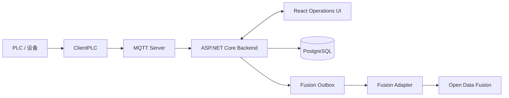

# Foxconn AI Solution
> [Tiếng Việt](README.md) · [English](README.en.md) · [简体中文](README.zh-CN.md)

## 概述

Foxconn AI Solution 是一个面向设备、生产线、遥测数据和告警的本地部署工业监控平台。系统通过 PLC/MQTT 接收遥测数据，将运营数据存储在 PostgreSQL 中，并提供实时 Operations UI。

## 核心能力

- 通过 ClientPLC 应用和 MQTT 从 PLC 采集数据。
- 在统一的 Operations UI 中监控设备状态、产量、遥测数据和告警。
- 使用 ASP.NET Core 和 PostgreSQL 存储并提供运营数据。
- 通过事务性 outbox 将可靠的遥测数据副本同步到 Open Data Fusion，并与 MQTT 热路径隔离。
- 独立部署和运维 Operations、Fusion Adapter 和 Open Data Fusion 组件。

## 架构

PLC 与 Operations 的数据流构成本地运行边界；Open Data Fusion 仅通过 outbox 和 adapter 接收数据，因此 ODF 故障不得阻塞遥测数据接收。



## 组件

| 路径 | 角色 |
| --- | --- |
| `frontend/` | 使用 React + Vite 构建的 Operations UI。 |
| `backend/` | ASP.NET Core 后端、MQTT 和 PostgreSQL。 |
| `ClientPLC/` | 用于连接和监控 PLC 设备的 WPF 客户端。 |
| `fusion-contracts/` | 用于 Fusion 事件的版本化共享契约。 |
| `fusion-adapter/` | 将事件分发到 ODF 的 outbox 调度器。 |
| `third_party/open-data-fusion/` | 为 Open Data Fusion 固定版本的上游 Git submodule。 |

## 快速开始

运行前提：.NET 9 SDK、Node.js、可访问且已通过 backend 的 connection string 配置的 PostgreSQL；如果使用 ODF preview，则还需要 Docker Desktop。ClientPLC 在 Windows 上运行，并且需要 .NET 9 Windows Desktop SDK。

按安全顺序端到端启动：

1. 获取源代码并初始化 submodule：

```powershell
git clone https://github.com/HaydernCenterpoint/Foxconn-AI-Solution.git
cd Foxconn-AI-Solution
git submodule update --init --recursive
```

2. Backend 同时托管 MQTT server。请在启动 backend 前启用本地 outbox 捕获：

```powershell
$env:OpenDataFusion__CaptureEnabled = 'true'
dotnet run --project backend/backend.csproj
```

让后端继续在终端 A 中运行；在终端 B 中执行 ODF 预览命令。

3. 如果使用 ODF preview，启动 `application-preview` 并等待 `http://127.0.0.1:54310/ready` 成功响应后再继续：

> [!WARNING]
> `application-preview` 使用 SQLite，仅用于本地/开发环境的 mapping 预览；不得将此 profile 或 `.env` 文件用于生产环境。

```powershell
$odfEnv = 'third_party/open-data-fusion/.env'
if (Test-Path -LiteralPath $odfEnv) {
  throw "$odfEnv already exists; review it instead of overwriting."
}
Copy-Item infrastructure/open-data-fusion/.env.example $odfEnv
Push-Location third_party/open-data-fusion
docker compose --env-file .env --profile application-preview up -d
Pop-Location
```

4. 保持 `OpenDataFusion__DispatchEnabled` 禁用，直到 ODF 已具备 tenant、project 和 identity。随后，按照 [Open Data Fusion 指南](infrastructure/open-data-fusion/README.md) 配置，启用 dispatch 并在单独终端运行 Fusion Adapter；不要将机密信息写入文档或源代码：

```powershell
$env:OpenDataFusion__DispatchEnabled = 'true'
dotnet run --project fusion-adapter/Fusion.Adapter.csproj
```

5. 上述组件准备就绪后，根据环境的 PLC 配置启动 ClientPLC，并在单独终端运行 Operations UI：

**启动 ClientPLC：**

```powershell
dotnet run --project ClientPLC/ClientPLC.App/ClientPLC.App.csproj
```

**启动 Operations UI：**

```powershell
npm --prefix frontend install
npm --prefix frontend run dev
```

## Open Data Fusion 集成

两个开关独立管理，用于控制同步流程：

- `OpenDataFusion__CaptureEnabled`：控制 backend 中本地事务性 outbox 的捕获。启用后，合格的遥测数据会与 outbox intent 一同记录；backend 不会从 MQTT 热路径直接调用 ODF。
- `OpenDataFusion__DispatchEnabled`：控制通过 Fusion Adapter 向 ODF 交付数据。启用后，Fusion Adapter 会将待处理的 outbox 事件交付到 ODF。仅在 ODF 已针对相应环境就绪后才启用。

参阅 [Open Data Fusion 指南](infrastructure/open-data-fusion/README.md) 以激活、选择生产拓扑并安全回滚。

## 项目结构

与平台直接相关的主要目录如下：

```text
.
├── backend/                         # ASP.NET Core Operations API
├── backend.Tests/                   # 后端测试
├── ClientPLC/                       # PLC 的 WPF 应用程序
├── frontend/                        # React + Vite Operations UI
├── fusion-contracts/                # 共享契约
├── fusion-adapter/                  # 向 ODF 分发 outbox 的工作程序
├── fusion-adapter.Tests/            # Fusion Adapter 测试
├── infrastructure/open-data-fusion/ # ODF 配置与指南
├── docs/superpowers/specs/          # 集成设计
└── third_party/open-data-fusion/    # 已固定版本的上游 Git submodule
```

## 测试与构建

请在 repository 根目录运行：

```powershell
dotnet test backend.Tests/backend.Tests.csproj
dotnet test fusion-adapter.Tests/Fusion.Adapter.Tests.csproj
npm --prefix frontend run test:run
npm --prefix frontend run type-check
npm --prefix frontend run build
```

## 相关文档

- [Open Data Fusion 运维](infrastructure/open-data-fusion/README.md)
- [Open Data Fusion 集成设计](docs/superpowers/specs/2026-07-13-open-data-fusion-integration-design.md)

## 安全与运维说明

请勿将机密信息或生产环境凭据提交到 repository。对于生产 ODF，请通过部署环境的机密管理器管理凭据和配置，并将敏感配置置于受跟踪源代码之外。
