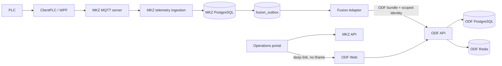

# Thiết kế tích hợp Open Data Fusion

**Ngày:** 2026-07-13  
**Trạng thái:** Thiết kế đã được chấp thuận để triển khai pha 1  
**Phạm vi:** Đồng bộ tin cậy dữ liệu vận hành MKZ sang Open Data Fusion (ODF), triển khai ODF độc lập và tạo điểm vào từ portal hiện có.

## Mục tiêu

Đưa dữ liệu máy/line và telemetry của MKZ vào ODF để dùng asset graph, provenance, time series, Canvas và quan hệ có kiểm duyệt, mà không thay đổi quyền vận hành PLC hiện tại. Lỗi hoặc thời gian ngừng của ODF không được làm chậm MQTT, PLC Client, dashboard vận hành hoặc lưu telemetry của MKZ.

## Quyết định kiến trúc

Người dùng thấy **một Factory Portal**, nhưng hệ thống vận hành như các ứng dụng độc lập:

- `frontend/` vẫn là ứng dụng Operations và là điểm vào chính.
- ODF Web là ứng dụng Data Fusion độc lập, không nhúng bằng iframe và không fork mã nguồn upstream.
- `factory-ai-platform/` và `Odysseus/` tiếp tục là lớp AI độc lập.
- Backend MKZ là nguồn sự thật cho trạng thái PLC, lệnh điều khiển, alarm và báo cáo vận hành.
- ODF là nguồn sự thật cho asset context, provenance, asset/time-series catalog, Canvas và các quan hệ được review.

ODF sẽ được giữ dưới dạng Git submodule tại `third_party/open-data-fusion`, ghim tại commit [`4dc804be5d3d5df0db516c68a02934076a42c9db`](https://github.com/HaydernCenterpoint/Open-Data-Fusion/commit/4dc804be5d3d5df0db516c68a02934076a42c9db). Mọi cấu hình triển khai của MKZ nằm ngoài submodule để cập nhật upstream không tạo fork.



## Ranh giới và quyền sở hữu dữ liệu

| Dữ liệu/chức năng | Chủ sở hữu | Cách ODF nhận dữ liệu |
| --- | --- | --- |
| PLC connection, MQTT, command/control, live machine state | MKZ (`ClientPLC`, `backend/`) | Không chuyển sang ODF |
| Raw telemetry, machine history, hourly production, operational alarm | MKZ PostgreSQL | Fusion outbox gửi bản sao sự kiện |
| Asset hierarchy, time-series catalog, provenance, Canvas, relation review | ODF | ODF API là đường ghi duy nhất |
| AI truy vấn vận hành thời gian thực | `factory-ai-platform` qua MKZ API | Không đổi ở pha 1 |
| AI truy vấn asset context/lịch sử đã fuse | ODF read client trong pha sau | Không triển khai ở pha 1 |

ODF không được truy cập trực tiếp vào cơ sở dữ liệu MKZ, và MKZ không được ghi trực tiếp vào database ODF. Chỉ Fusion Adapter được phép gọi `POST /api/v1/ingest/bundle` của ODF. Đây là endpoint và scope model mà upstream công bố trong [API README](https://github.com/HaydernCenterpoint/Open-Data-Fusion/blob/main/apps/api/README.md).

## Pha 1 được triển khai

Pha 1 bao gồm bốn lát cắt có thể chạy độc lập:

1. Ghim ODF upstream và có cấu hình local/production-like không trùng cổng với các stack hiện tại.
2. Thêm transactional outbox cho telemetry MKZ; không gọi HTTP từ hot path MQTT.
3. Thêm một .NET Worker độc lập để đọc outbox, tạo ODF bundle, retry và đánh dấu kết quả.
4. Thêm một entry Data Fusion có feature flag trong portal hiện có; entry là deep link cùng tab, không phải iframe.

Pha 1 không bao gồm backfill lịch sử, đồng bộ document bytes, thay thế `factory-ai-platform/data-platform`, chuyển alarm sang ODF, gửi lệnh từ ODF về PLC, hoặc SSO production. Các phần này là các dự án sau vì chúng có quyền sở hữu dữ liệu và mức rủi ro khác nhau.

## Cấu trúc mã đích

```text
third_party/
  open-data-fusion/                 # Git submodule, upstream nguyên vẹn, pin commit

fusion-contracts/
  Fusion.Contracts.csproj           # Contract event JSON versioned dùng chung
  TelemetryFusionEvent.cs

fusion-adapter/
  Fusion.Adapter.csproj             # .NET 9 Worker, độc lập backend
  Program.cs
  Configuration/OpenDataFusionOptions.cs
  Outbox/FusionOutboxRepository.cs
  Outbox/FusionOutboxDispatcher.cs
  Mapping/OpenDataFusionBundleMapper.cs
  Transport/OpenDataFusionClient.cs

fusion-adapter.Tests/
  Fusion.Adapter.Tests.csproj
  Mapping/OpenDataFusionBundleMapperTests.cs
  Transport/OpenDataFusionClientTests.cs
  Outbox/FusionOutboxDispatcherTests.cs

infrastructure/open-data-fusion/
  .env.example                      # Không chứa secret
  README.md                          # Cách chạy local, smoke test, rollback

backend/
  Services/DatabaseService.cs        # DDL fusion_outbox và persistence nguyên tử
  Services/TelemetryIngestionService.cs
  appsettings.json                   # Chỉ default không nhạy cảm, capture tắt
  appsettings.Development.json       # URL/identity dev không nhạy cảm

frontend/
  ...                                # Link Data Fusion được bật bởi VITE_ODF_WEB_URL
```

`fusion-contracts` chỉ chứa record và JSON contract không phụ thuộc database hoặc HTTP. `fusion-adapter` có thể deploy/scale/restart riêng; backend không tham chiếu adapter và adapter không có quyền điều khiển PLC.

## Luồng telemetry và transactional outbox

`TelemetryIngestionService` hiện nhận MQTT message qua `Channel<string>`, ghi `machine_telemetry`, sau đó cập nhật machine/history/hourly table và phát SignalR. Luồng mới giữ nguyên trình tự vận hành này, nhưng thay thế cặp ghi raw telemetry + sự kiện fusion bằng một transaction PostgreSQL:

1. Parse và xác thực `machineId` là UUID, như logic hiện có.
2. Lấy snapshot bất biến của máy và line tại thời điểm nhận sự kiện.
3. Trong một Npgsql transaction, chèn `machine_telemetry` và một row `fusion_outbox` nếu `OpenDataFusion:CaptureEnabled=true`.
4. Commit transaction.
5. Cập nhật state/history/hourly table và broadcast SignalR theo hành vi hiện có.
6. Adapter đọc row đã commit; MQTT path không đợi ODF trả lời.

Nếu raw telemetry không ghi được thì outbox cũng không được ghi. Nếu ODF ngừng hoạt động thì telemetry MKZ vẫn tiếp tục được lưu; row outbox sẽ chờ retry.

### Bảng `fusion_outbox`

```sql
CREATE TABLE fusion_outbox (
    id UUID PRIMARY KEY,
    schema_version INTEGER NOT NULL,
    event_type VARCHAR(100) NOT NULL,
    event_key VARCHAR(512) NOT NULL UNIQUE,
    payload JSONB NOT NULL,
    occurred_at TIMESTAMPTZ NOT NULL,
    status VARCHAR(16) NOT NULL,
    attempts INTEGER NOT NULL DEFAULT 0,
    available_at TIMESTAMPTZ NOT NULL,
    locked_at TIMESTAMPTZ NULL,
    lock_id UUID NULL,
    delivered_at TIMESTAMPTZ NULL,
    last_error TEXT NULL,
    created_at TIMESTAMPTZ NOT NULL DEFAULT CURRENT_TIMESTAMP
);

CREATE INDEX idx_fusion_outbox_dispatch
    ON fusion_outbox (status, available_at, created_at);
```

Trạng thái hợp lệ là `PENDING`, `PROCESSING`, `DELIVERED`, và `DEAD`. `event_key` là `telemetry:<machine-guid>:<sequence>` khi sequence dương; khi sequence bằng 0, nó là `telemetry:<machine-guid>:<sha256(raw-json)>`. Unique key làm cho việc gửi lại MQTT không tạo thêm intent đồng bộ trong MKZ.

Payload là `TelemetryFusionEvent` version 1, gồm `eventId`, `eventKey`, `occurredAt`, snapshot `machine`, snapshot `line` có thể rỗng, và telemetry envelope gốc đã parse. Adapter chỉ dựa vào payload này khi dispatch, không query lại state mutable của máy.

## Quy tắc ánh xạ ODF

### Tenant, project và asset hierarchy

- Tenant ODF = tổ chức sở hữu nhà máy.
- Project ODF = một site/nhà máy, không phải production line.
- ID tenant/project được cấu hình bằng `ODF_TENANT_ID` và `ODF_PROJECT_ID`; ở PostgreSQL profile, đây là UUID đã provision trong ODF.
- Plant root được cấu hình bởi `ODF_PLANT_EXTERNAL_ID` và `ODF_PLANT_NAME`.
- Line và machine dùng database UUID, không dùng tên có thể đổi.

| Đối tượng MKZ | ODF asset external ID | Parent |
| --- | --- | --- |
| Factory/site | `mkz:plant:<site-code>` | Không có |
| Production line | `mkz:line:<line-guid>` | Plant |
| Machine | `mkz:machine:<machine-guid>` | Line nếu có, nếu không là Plant |

Metadata asset chỉ chứa thuộc tính chậm thay đổi: `sourceSystem`, `machineCode`, `clientId`, database ID và line ID. Không ghi trạng thái `RUNNING`/`OFFLINE` vào asset metadata vì đó là telemetry biến động.

### Time series và datapoint

ODF bundle chỉ nhận datapoint số; do đó string state không được đưa trực tiếp vào `value`. Mỗi event tạo time-series khi cần và gửi datapoint cùng timestamp UTC từ `sentAt`; nếu thiếu/không parse được thì dùng thời điểm server nhận telemetry.

| Trường MKZ | ODF time-series suffix | Quy tắc |
| --- | --- | --- |
| `production.qty` | `production_qty` | Giá trị số nguyên |
| `production.time` | `production_time` | Giá trị số; không gán unit khi PLC chưa định nghĩa unit |
| `oee` | `oee` | Giá trị số nguồn cung cấp |
| `yieldRate` | `yield_rate` | Giá trị số nguồn cung cấp |
| `plcConnected` | `plc_connected` | `true=1`, `false=0` |
| `status` | `machine_state_code` | `OFFLINE=0`, `RUNNING=1`, `IDLE=2`, `STOPPED=3`, `ALARM=4`, khác=`99` |
| `alarm` boolean nếu có | `alarm_active` | `true=1`, `false=0` |
| `cpuPercent`, `ramPercent`, `uptimeSeconds` nếu có | `cpu_percent`, `ram_percent`, `uptime_seconds` | Giá trị số; `uptime_seconds` có unit `s` |

Time-series external ID có dạng `mkz:ts:<machine-guid>:<metric>`. Quality là `good` khi PLC đang connected và `uncertain` khi không connected. Event parse lỗi sẽ không được gửi vì không thể tạo outbox row hợp lệ.

Alarm record vẫn thuộc MKZ. Pha 1 chỉ phản ánh tín hiệu numeric `alarm_active` nếu payload cung cấp; không tạo hoặc resolve alarm record trong ODF. Document service hiện tại vẫn sở hữu file/embedding; pha 1 không copy byte hoặc metadata document sang ODF. Quan hệ line topology nâng cao sẽ được đưa vào ODF ở pha backfill dưới dạng `proposed`, không ở telemetry hot path.

Bundle dùng `source.system = "mkz-plc-monitoring"`, `source.runId = fusion_outbox.id`, và `source.actor = "mkz-fusion-adapter"`, phù hợp contract bundle của [ODF edge-agent](https://github.com/HaydernCenterpoint/Open-Data-Fusion/blob/main/apps/edge-agent/src/types.ts).

## Adapter, retry và lỗi

Adapter là một .NET 9 Worker duy nhất về chức năng; nhiều replica có thể chạy vì claim row dùng `FOR UPDATE SKIP LOCKED` và `lock_id`/lease. Nó đọc tối đa 50 row sẵn sàng, lease 30 giây, tạo bundle, và gọi ODF API với timeout HTTP 10 giây.

- HTTP 2xx: row thành `DELIVERED`, lưu `delivered_at`.
- Network failure, timeout, HTTP 408, 429 và 5xx: row trở lại `PENDING`, tăng `attempts`, và đặt `available_at` theo exponential backoff có giới hạn 5 phút.
- Bundle validation failure (400/422): row thành `DEAD` ngay, lưu lỗi đã rút gọn tối đa 4 KiB để không retry payload sai vô hạn.
- Authentication/token acquisition failure và 401/403: retry theo giới hạn 12 lần vì credential có thể đang xoay; sau lần cuối row thành `DEAD`.
- `DEAD` không tự xóa. Operator sửa cấu hình/mapping rồi requeue row bằng thao tác SQL có audit hoặc command quản trị của adapter trong pha vận hành tiếp theo.

Health log của adapter phải báo số row `PENDING`, `PROCESSING`, `DEAD`, age của row cũ nhất và lần dispatch thành công gần nhất. Không ghi Bearer token, client secret hoặc full raw payload vào log lỗi.

## Bảo mật và identity

ODF có scope header bắt buộc `x-odf-tenant-id` và `x-odf-project-id`, và production auth dựa trên OIDC thay vì JWT HS256 hiện tại của backend MKZ. [Tài liệu authentication của ODF](https://github.com/HaydernCenterpoint/Open-Data-Fusion/blob/main/docs/security/authentication.md) xác nhận hai header scope không thay thế authentication.

- Local smoke test dùng ODF development identity (`x-odf-user`) và chỉ bind service vào `127.0.0.1`.
- Integration/production dùng OIDC client credentials của một service account riêng, chỉ có `data:ingest` và membership editor/owner của project cần thiết.
- Adapter cache access token đến trước thời hạn hết hạn; không dùng token JWT của người dùng frontend MKZ.
- ODF PostgreSQL, Redis và object store dùng volume/network/secret riêng. Không tái dùng PostgreSQL của MKZ hay `factory-ai-platform`.
- Adapter database role chỉ có `SELECT`/`UPDATE` trên `fusion_outbox`; backend role mới được `INSERT`. Không cấp quyền PLC, `machines` update hoặc ODF database.
- Secret chỉ đi qua environment/secret manager (`ODF_CLIENT_SECRET`, database passwords). Không đưa secret mới vào `appsettings*.json`, `.env.example` hay Git.

## Triển khai ODF

ODF upstream có Docker Compose cho API, Web, PostgreSQL, Redis và worker. Default host port của ODF trùng 5432/6379/3000 với các stack hiện có; cấu hình MKZ đặt các override sau trong `infrastructure/open-data-fusion/.env.local` (file này bị ignore) và cung cấp template không secret `.env.example`:

| Biến | Giá trị local MKZ | Lý do |
| --- | --- | --- |
| `COMPOSE_PROJECT_NAME` | `mkz-odf` | Cô lập container/volume name |
| `ODF_POSTGRES_PORT` | `55432` | Không trùng PostgreSQL hiện có trên 5432 |
| `ODF_REDIS_PORT` | `56379` | Không trùng Redis local nếu có |
| `ODF_API_PORT` | `54310` | Endpoint adapter local |
| `ODF_WEB_PORT` | `58088` | Entry Data Fusion của portal |
| `ODF_GRAFANA_PORT` | `53000` | Không trùng frontend dev port 3000 |
| `ODF_PROMETHEUS_PORT` | `59090` | Quan sát local tùy chọn |

Smoke test local có thể dùng profile `application-preview` của upstream với SQLite để kiểm tra bundle. Bất kỳ môi trường nào có dữ liệu nghiệp vụ dùng profile production-like của ODF với `ODF_DATA_PERSISTENCE=postgres`, PostgreSQL riêng, Redis riêng và object store dùng chung; không dùng SQLite profile như data store production. Upstream mô tả rõ PostgreSQL là persistence boundary production và không cho phép application dual-write thành hai nguồn sự thật ([architecture decision](https://github.com/HaydernCenterpoint/Open-Data-Fusion/blob/main/docs/architecture/0005-postgresql-cutover-and-transactional-outbox.md)).

## Portal và UX

`frontend/` thêm một navigation item **Data Fusion** chỉ hiện khi `VITE_ODF_WEB_URL` được cấu hình. Link điều hướng cùng tab sang ODF Web. Không nhúng iframe vì ODF dùng OIDC và SSE; iframe sẽ làm session, CSP, redirect và nâng cấp upstream khó kiểm soát.

Pha 1 chưa giả lập SSO. Ở môi trường local, người dùng có thể phải đăng nhập ODF riêng. Pha SSO sau sẽ dùng một OIDC issuer chung cho Operations, ODF và AI Assistant; lúc đó portal vẫn giữ vai trò navigator chứ không gộp codebase React của ODF vào `frontend/`.

## Kiểm thử và tiêu chí nghiệm thu

Mỗi hành vi mới có test trước implementation:

1. Unit test contract/mapping: một telemetry event tạo đúng assets, time-series, datapoints, external ID, timestamp, quality và state code.
2. Unit test transport: adapter gửi đúng route/header/auth; 2xx đánh dấu delivered; 503/timeout được schedule retry; 422 thành dead letter.
3. Unit test dispatch: hai dispatcher không claim cùng một row lease hợp lệ.
4. PostgreSQL integration test có điều kiện qua `MKZ_TEST_POSTGRES_CONNECTION`: raw telemetry và fusion outbox cùng commit hoặc cùng rollback.
5. Compose smoke test: ODF API health `GET /ready`, provision project development, gửi một bundle và kiểm tra asset/time-series có thể đọc lại theo scope.
6. Regression: `dotnet test backend.Tests/backend.Tests.csproj`, build backend, build adapter, `npm run lint` và `npm run build` của frontend sau khi navigation link được thêm.

Pha 1 được chấp nhận khi một telemetry hợp lệ:

- vẫn xuất hiện ở MKZ dashboard khi ODF tắt hoặc không reachable;
- tạo đúng một outbox intent khi capture bật;
- được gửi lại sau khi ODF hồi phục mà không cần gửi lại từ PLC;
- tạo plant/line/machine hierarchy và numeric datapoints đúng scope trong ODF;
- không để secret xuất hiện trong file tracked hoặc log;
- có thể rollback bằng cách tắt `OpenDataFusion:CaptureEnabled` và dừng adapter mà không thay đổi luồng PLC/MQTT.

## Lộ trình sau pha 1

1. Backfill machine/line và lịch sử trong cửa sổ thời gian đã chọn, với checkpoint để có thể resume.
2. Đồng bộ metadata document/URI có provenance; chỉ di chuyển object bytes sau khi owner chấp thuận ODF object-store là canonical.
3. Provision OIDC/SSO chung, role/group mapping và portal navigation production.
4. Thêm ODF read client cho AI gateway và surface Data Fusion links trong report; giữ mọi tool điều khiển PLC chỉ ở MKZ.
5. Dọn `factory-ai-platform/data-platform` sau khi xác định dứt khoát một chiến lược time-series, không chạy song song three-way dual-write.

## Rollback

Rollback không xóa database hoặc submodule. Tắt `OpenDataFusion:CaptureEnabled`, dừng `fusion-adapter`, và giữ các row chưa dispatch trong `fusion_outbox` để có thể tiếp tục sau. ODF có thể được stop độc lập; PLC Client, MQTT server, backend, SignalR và frontend Operations tiếp tục chạy theo hành vi trước tích hợp.
