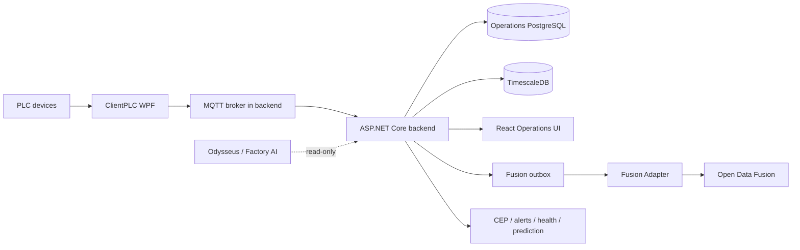

# Architecture Map

## Core boundary
- PLC/MQTT/Operations is the local operational path.
- ODF is asynchronous via outbox/adapter.
- ODF failure must not block telemetry ingestion.

## Product intelligence
- Alerts lifecycle + evidence
- Asset health score/history
- Baseline anomaly / risk prediction
- Basic RCA correlation
- File watcher + ERP connector framework

## Invariants
1. Do not block MQTT hot path
2. Intelligence fails open; no fake production success
3. Authenticated fallback + operator-only mutations
4. Browser sessions remain cookie-based
5. Managed gate rejects HTTP/loopback and requires exactly 16 checks
6. Secrets never enter git/appsettings/images
7. Dual-write rollback remains available before production claim

## Systems
[[60 Systems/Systems]] · [[10 Project/Product Scope]] · [[10 Project/Repo Map]]